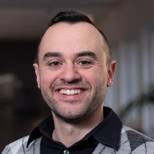

# Marco Camurri

Marco Camurri is Associate Professor at the Department of Industrial Engineering of the University of Trento. Previously, I was Associate Professor (RTD-A) at the Field Robotics South Tyrol (FiRST), working on autonomous mobile robot navigation in the field. From 2018 to 2022 I served as PDRA and Senior Researcher in robot navigation at the Dynamic Robot System lab of the Oxford Robotics Institute, University of Oxford, UK. From 2014 to 2018 I was member of the Dynamic Legged System (DLS) lab at the Istituto Italiano di Tecnologia (IIT) in Genoa, Italy, where I received my PhD in Bioengineering and Robotics in 2017. I have received the B.Eng. and M.Eng. degrees in computer engineering from the University of Modena and Reggio Emilia, Modena, Italy, in 2009 and 2012, respectively.

Webpage: [institutional](https://webapps.unitn.it/du/it/Persona/PER0221571/Curriculum)

Linkedin: [www.linkedin.com/in/marco-camurri-a8750783](https://www.linkedin.com/in/marco-camurri-a8750783/)

Github: [github.com/mcamurri](https://github.com/mcamurri)
