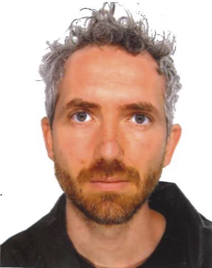

# Andrea Del Prete

Andrea Del Prete is Associate Professor in the Department of Industrial Engineering at the University of Trento, where he is part of the Interdepartmental Robotics Lab (IDRA). His research sits at the crossroads of **robot control, reinforcement learning, trajectory optimization, safety certificates, and numerical algorithms**, with a strong focus on making robots smarter, safer, and more capable in the real world.

Before joining Trento, he worked at the Max Planck Institute for Intelligent Systems, LAAS-CNRS, and the Italian Institute of Technology, contributing to advanced control and optimization methods for humanoid platforms including **iCub, HRP-2, and Athena**. Over the years, his work has consistently connected rigorous theory with hands-on robotic systems, especially in locomotion and whole-body control.

Andrea teaches courses on **optimal control, reinforcement learning for robotics, and C++ programming**, and he has developed dedicated training on the **optimization-based control of legged robots**, covering topics such as task-space inverse dynamics, trajectory optimization, footstep planning, and walking in simulation. He is also a frequent invited speaker on themes such as safe robot control, reinforcement learning, and trajectory optimization for legged systems.

His summer school lectures bring together the mathematics, algorithms, and practical intuition needed to understand how legged robots move—and how we can make them move better.

[Personal Website](https://andreadelprete.github.io/)
