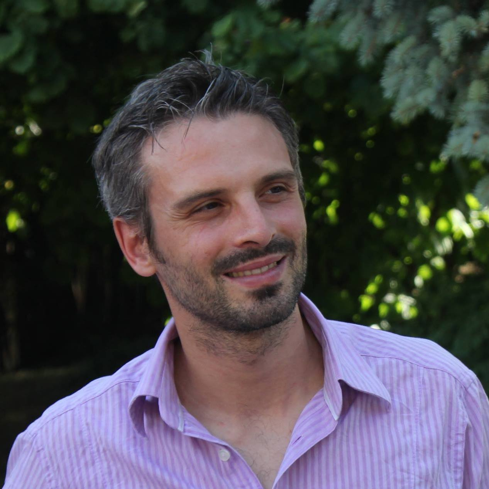

# Michele Focchi

Michele Focchi is a world-recognized expert in motion planning and control of quadruped robots, with over 16 years of 
<a href="https://www.dropbox.com/scl/fi/c4w55iiwtb9erftwxxab2/Achievements_Michele_focchi.docx?rlkey=0yeguww7iy06w2074ugz3sfyr">experience</a>   in robotics research. He is currently a Professor at the University of Trento in the <a href="https://www.disi.unitn.it">Department of Information Engineering and Computer Science (DISI)</a>, where he teaches robotics courses at the bachelor, master, and PhD levels. He is also a Scientific Advisor for industrial partners like <a href="https://all3.com/">AI3 Robotics</a> . Prof. Focchi earned both his B.Sc. and M.Sc. degrees in Control Systems Engineering from Politecnico di Milano and completed his Ph.D. in Robotics at Italian Institute of Technology (IIT) in 2013, contributing to the development of the first Italian quadruped robot (<a href="https://dls.iit.it/web/dynamic-legged-systems/hyq">HyQ</a>). During his time at IIT, he co-founded the <a href="https://dls.iit.it">Dynamic Legged Systems Lab</a>, an internationally recognized research team focused on the development of quadruped robots and advanced locomotion strategies. His research lies at the intersection of control, optimization, and machine learning, with a strong focus on optimization-based and Model Predictive Control techniques for robust locomotion in unstructured and challenging environments. His work has evolved from low-level locomotion controllers to whole-body control, model identification, and uncertainty-aware motion planning for real-world applicatoms. He is particularly known for his pioneering contributions to heuristic locomotion strategies for quadruped robots operating in rough terrain. Beyond quadruped locomotion, Prof. Focchi has developed and studied innovative robotic platforms, including rappelling robots for hydro-geological risk reduction and inspection in oil & gas scenarios, as well as control and navigation strategies for tracked robots in agricultural applications. He has played leading roles in several high-profile academic and industrial projects, including ECHORD++, <a href="https://advr.iit.it/projects/inail-scc/teleoperazione">INAIL</a>, and <a href="https://nebula.esa.int/content/autonomous-non-wheeled-all-terrain-rover-ant">ANT</a>  with the European Space Agency (ESA) and, more recently, EUREGIO and <a href="https://www.fondazionevrt.it/15-future-of-work-2025">VRT</a>. 
In 2015, he co-founded the MOOG–IIT Joint Lab, focused on the development of next-generation software and control technologies for autonomous robots. He is the inventor and co-inventor of several patents; notably, in 2009 he contributed to a patented micro-turbine technology that led to the creation of the Advanced Microturbines spin-off company. He has organized several scientific workshops, including a workshop on numerical optimization at Robotics: Science and Systems (RSS), and has delivered more than 25 invited talks at international conferences and workshops.
He is the organizer of the firs PhD summer school on Quadruped Robots and Dog Challenges in Italy at I-RIM and at the European Robotics Forum.  He has authored or co-authored 50+ scientific publications in top international journals and conferences and has supervised numerous master’s and Ph.D. theses. He currently serves as an Associate Editor for IEEE Robotics and Automation Letters (RA-L) and for the IEEE International Conference on Robotics and Automation (ICRA).
He is part of a rising circle of robotics professors at UNITN, united by a shared ambition: to build a powerful hub of innovation and expertise in Italy’s robotics landscape.  This initiative, known as <a href="https://idra.unitn.it/">Idra labs</a>, aims to become a new center of gravity for cutting-edge robotics research in Italy.

 

Webpages: [personal](https://mfocchi.github.io), [institutional](https://webapps.unitn.it/du/it/Persona/PER0221571/Curriculum)

Linkedin: [www.linkedin.com/in/michelefocchi](https://www.linkedin.com/in/michelefocchi)

Youtube: [Channel](https://www.youtube.com/@mfocchichannel/playlists)

Github: [github.com/mfocchi](https://github.com/mfocchi)

