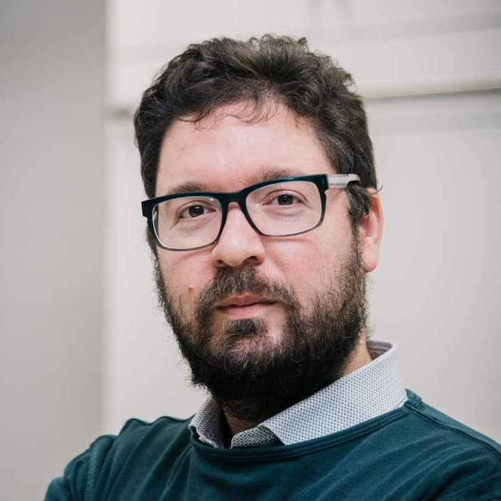

# Marco Frego

Marco Frego is an expert in path and motion planning and optimal control, with over 10 years of 
  in robotics research. He is currently a Professor at the Free University of Bozen-Bolzano in the <a href="https://www.unibz.it/it/faculties/engineering/">Faculty of Engineering </a>, where he teaches robotics/control courses at the bachelor.  Prof. Frego earned both his B.Sc. and M.Sc. degrees in Mathematics from University of Trento and completed his Ph.D. in Mechatronics at the Department of Industrial Engineering of the University of Trento, contributing to the development of a library for path planning with clothoid curves (<a href="https://github.com/ebertolazzi/Clothoids">Clothoids</a>). His research lies at the intersection of control, optimization, and applied mathematics, with a strong focus on optimization-based planning techniques for autonomous robots. He is known for his advances on clothoid curves and other path planning methods, like the Markov-Dubins problem.  He has authored or co-authored 40+ scientific publications in top international journals and conferences and has supervised bachelor's, master’s and Ph.D. theses. He served as an Associate Editor for IEEE Robotics and Automation Letters (RA-L).

 

Webpages: [institutional](https://www.unibz.it/it/faculties/engineering/academic-staff/person/44497-marco-frego)

Github: [github.com/mfrego](https://github.com/mfrego)

